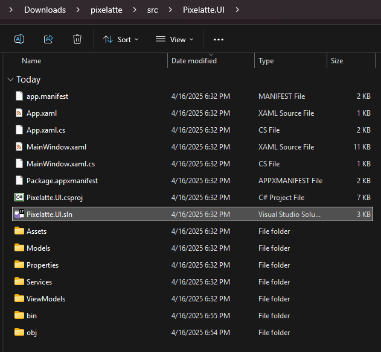
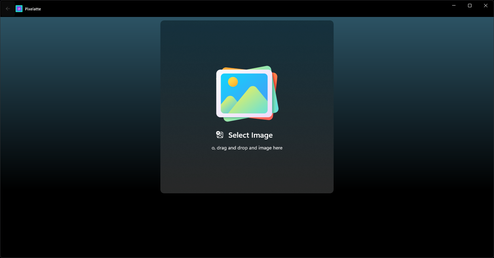

<p align="center">

</p>
<h1 align="center">Pixelatte</h1>

# 🖼️ Introduction

Pixelatte is an intuitive and powerful desktop app designed for image processing through well-known libraries for Python. Whether you're a learning or teaching image processing techniques, Pixelatte helps you to apply pixel level operations and get instant visual feedback.

<p align="center">

</p>

# 💻 How to run Pixelatte

Pixelatte is compound of a backend written in Python and a GUI made with WinUI3. The GUI depends on the backend so make sure the local server is always running before starting the GUI.

## Prerequisites

- Git
- Python3.11 or grather
- Visual Studio 2022 & WinUI application development workload


## Get Pixelatte

Clone the repository

```bash
git clone https://github.com/itonx/pixelatte.git
```

Go to the local repository

```bash
cd pixelatte
```

## Run the backend

Go to the backend directory

```bash
cd .\src\backend\
```

Create a virtual environment for the backend

```bash
python -m venv .\src\backend\.venv
```

Activate the virtual environment.

> After activating the environment you'll see the name of your environment in the prompt which means you're using the virtual enviroment.

```bash
.\.venv\Scripts\activate
```

Install dependencies

```bash
pip install -r .\requirements.txt
```

Run local server

```bash
fastapi dev .\api.py
```

## Run the GUI

Open the solution located in `YOUR_PATH\pixelatte\src\Pixelatte.UI\Pixelatte.UI.sln` with Visual Studio 2022.



Build the solution


Run the app




# ⚙️ How to use Pixelatte

Load an image by clicking on the `Select image` card and select an image


Next you can explore and play with all the image processing functions available in Pixelatte

## Example


## Special Thanks

<a href="https://www.flaticon.com/free-icons/picture" title="picture icons">Select image icon created by Freepik - Flaticon</a>
